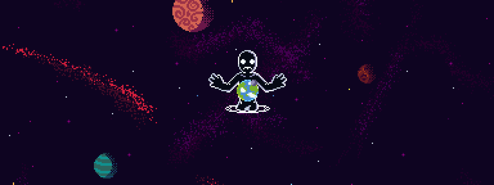

<h1 align="center">Hi! I'm Chara :D</h1>

##  📖 About Me

  - 19 y/o
   
  - She/her
   
  - Canadian
  
  #
  I'm a CST Student from BC.
   
  Hobby game dev and aspiring computer programmer.
   
  I love to make random projects, but don't have as much time/motivation as I want to.
   
  https://chaara.dev

 

 

<h1 align="center">
  I'm currently listening to:
</h1>

  

  
    Reload the page to update song information!
  

 

  
  
  
  
  
  
  
  
  

###